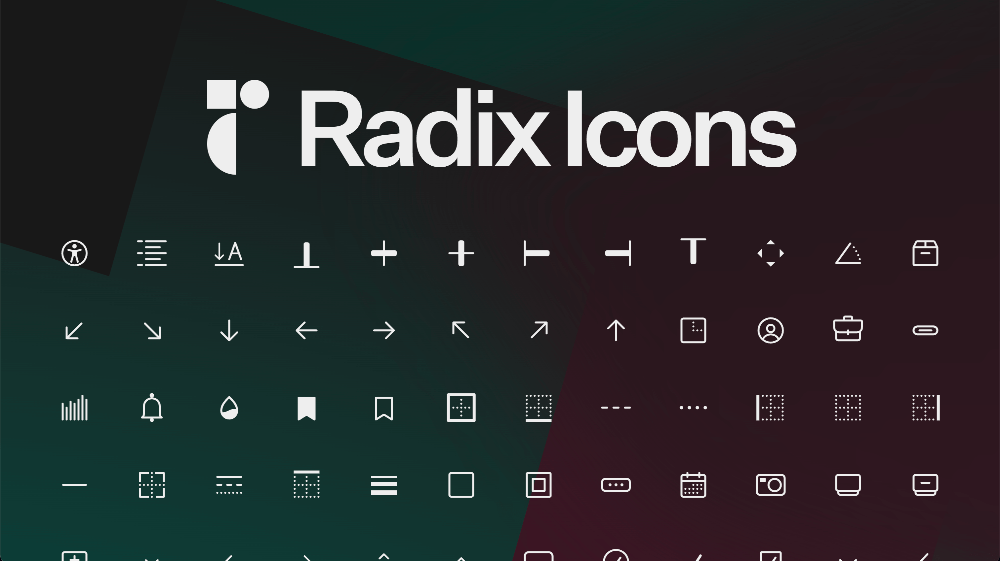

# Radix Icons

A crisp set of 15×15 icons designed by the [WorkOS](https://workos.com) team.

---

## Documentation

For full documentation, visit [radix-ui.com/icons](https://radix-ui.com/icons).

## Authors

- Vlad Moroz ([@vladyslavmoroz](https://twitter.com/vladyslavmoroz))
- Colm Tuite ([@colmtuite](https://twitter.com/colmtuite))
- Pedro Duarte ([@peduarte](https://twitter.com/peduarte))
- Lochlan Bunn ([@loklaan](https://twitter.com/loklaan))

## License

Licensed under the MIT License, Copyright © 2022-present WorkOS.

See [LICENSE](./LICENSE) for more information.
